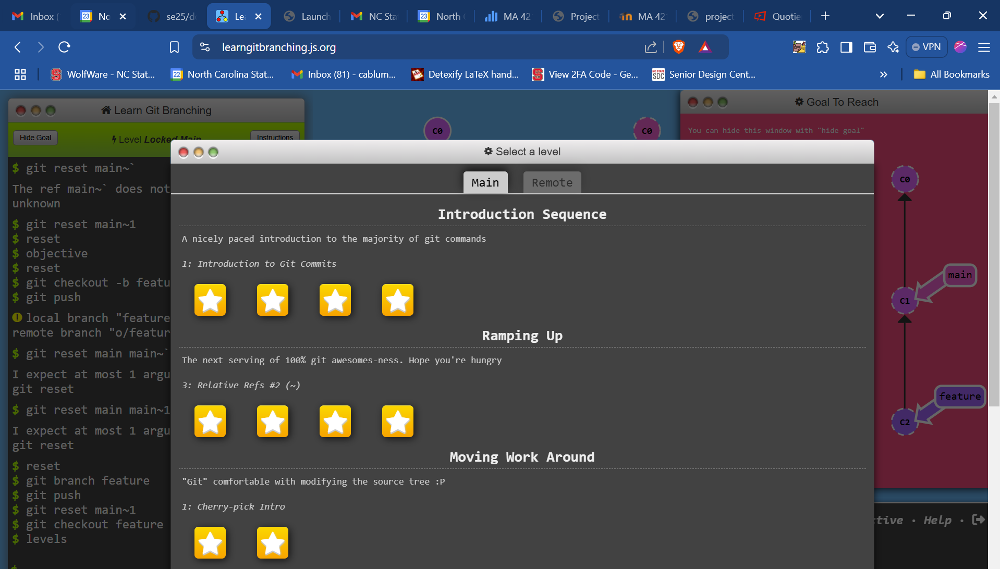
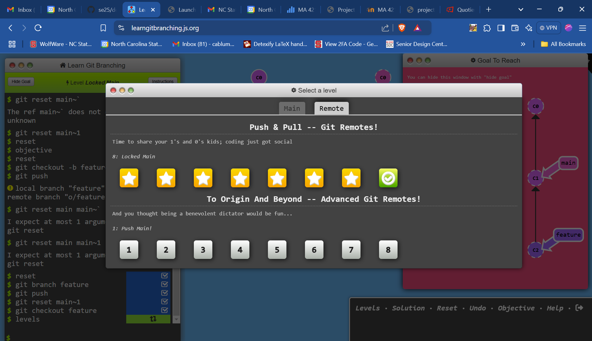

[](https://doi.org/10.5281/zenodo.14630305)


#### 1️⃣ Headers

## Group 5 Homework 2


#### 2️⃣ Image




#### 3️⃣ Code Example


```sh
# Stage all changes for commit
git add .


# Commit the staged changes with a message
git commit -m "Add changes"


# Push to the remote repository
git push origin YOUR_BRANCH
```


#### 4️⃣ Task List


##### ✅ Task List  


- [x] Task 1: Complete Git Tutorial 
- [x] Task 2: Add Screenshots to `README.md`  
- [x] Task 3: Modify `.html` File  
- [x] Task 4: Merge latest changes  
- [ ] Task 5: Review pull requests 


---
